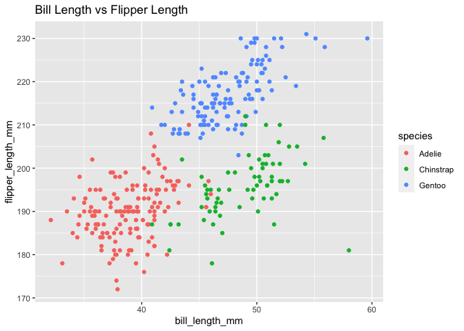

p8105\_hw1\_wq2160
================
Wenshan Qu (wq2160)
9/28/2021

### Problem 1

#### Create a data frame hw1\_df comprised of: 1). a random sample of size 10 from a standard Normal distribution; 2). a logical vector indicating whether elements of the sample are greater than 0; 3). a character vector of length 10; 4). a factor vector of length 10, with 3 different factor “levels”.

``` r
## create the data frame "hw1_df"
hw1_df =
  tibble(
    sample = rnorm(10),
    gr_than_0 = sample > 0,
    vec_char = c("a", "b", "c", "d", "e", "f", "g", "h", "i", "j"),
    vec_factor = factor(c(1, 1, 2, 3, 3, 3, 2, 3, 1, 3), 
                        levels = c("1", "2", "3"))
  )

## show the data frame
hw1_df
```

    ## # A tibble: 10 × 4
    ##    sample gr_than_0 vec_char vec_factor
    ##     <dbl> <lgl>     <chr>    <fct>     
    ##  1 -1.74  FALSE     a        1         
    ##  2  0.186 TRUE      b        1         
    ##  3 -0.136 FALSE     c        2         
    ##  4  1.48  TRUE      d        3         
    ##  5  0.459 TRUE      e        3         
    ##  6  0.601 TRUE      f        3         
    ##  7  1.16  TRUE      g        2         
    ##  8  2.05  TRUE      h        3         
    ##  9  1.01  TRUE      i        1         
    ## 10  0.338 TRUE      j        3

#### Take the mean of each variable:

``` r
## take the mean of sample
hw1_df %>% pull(sample) %>% mean()
## [1] 0.5410515
mean(hw1_df$sample)
## [1] 0.5410515
## take the mean of logical vector
hw1_df %>% pull(gr_than_0) %>% mean()
## [1] 0.8
mean(hw1_df$gr_than_0)
## [1] 0.8
## take the mean of character vector
hw1_df %>% pull(vec_char) %>% mean()
## [1] NA
mean(hw1_df$vec_char)
## [1] NA
## take the mean of factor vector
hw1_df %>% pull(vec_factor) %>% mean()
## [1] NA
mean(hw1_df$vec_factor)
## [1] NA
```

#### The result above shows that the variable “sample” and “logical factor” could be taken the mean, while the “character factor” and “factor vector” could not.

#### Then, we convert the type of variables:

``` r
as.numeric(hw1_df$sample)

as.numeric(hw1_df$gr_than_0)

as.numeric(hw1_df$vec_char)

as.numeric(hw1_df$vec_factor)
```

#### The variable type of “sample” and “logical vector” could be converted, the “character factor” could not be converted because it is nominal data. As for “factor vector”, I defined it as numeric factor so it could be converted to numbers here; but if I denined it as “male”, “female”, and “prefer not to say”, then it could NOT be converted and the output will be “NA”.

#### Another thing about the “factor vector” is that: Why the mean of vec\_factor could not be calculated but it could be converted to numbers. My explanition is: in the data frame, I defined vec\_factor using `c()`, so even the factors are actually numbers, they are not considered as numbers by R (they are considered more like “text”). But because they are really numbers, they could be converted to numbers using `as.numeric` function.

### Problem 2

``` r
## load "penguins" dataset
data("penguins", package = "palmerpenguins")
```

#### Write a short description of the `penguins` dataset:

``` r
## show the dataset
penguins
```

    ## # A tibble: 344 × 8
    ##    species island    bill_length_mm bill_depth_mm flipper_length_mm body_mass_g
    ##    <fct>   <fct>              <dbl>         <dbl>             <int>       <int>
    ##  1 Adelie  Torgersen           39.1          18.7               181        3750
    ##  2 Adelie  Torgersen           39.5          17.4               186        3800
    ##  3 Adelie  Torgersen           40.3          18                 195        3250
    ##  4 Adelie  Torgersen           NA            NA                  NA          NA
    ##  5 Adelie  Torgersen           36.7          19.3               193        3450
    ##  6 Adelie  Torgersen           39.3          20.6               190        3650
    ##  7 Adelie  Torgersen           38.9          17.8               181        3625
    ##  8 Adelie  Torgersen           39.2          19.6               195        4675
    ##  9 Adelie  Torgersen           34.1          18.1               193        3475
    ## 10 Adelie  Torgersen           42            20.2               190        4250
    ## # … with 334 more rows, and 2 more variables: sex <fct>, year <int>

``` r
## names of important variables
names(penguins)
```

    ## [1] "species"           "island"            "bill_length_mm"   
    ## [4] "bill_depth_mm"     "flipper_length_mm" "body_mass_g"      
    ## [7] "sex"               "year"

``` r
## the size of dataset
dim(penguins)
```

    ## [1] 344   8

``` r
nrow(penguins)
```

    ## [1] 344

``` r
ncol(penguins)
```

    ## [1] 8

``` r
## the mean of flipper length
mean(penguins$flipper_length_mm, na.rm = T)
```

    ## [1] 200.9152

#### Make a scatterplot of `flipper_length_mm` vs `bill_length_mm`

``` r
ggplot(penguins, aes(x = bill_length_mm, y = flipper_length_mm)) +
  geom_point(aes(color = species)) +
  ggtitle("Bill Length vs Flipper Length")
```

<!-- -->
